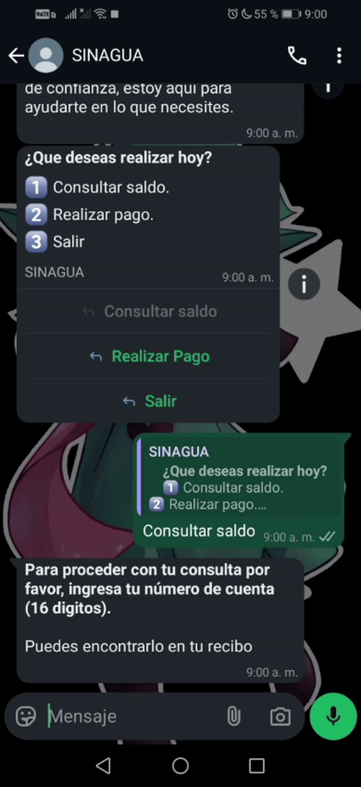

# 🤖 SINAGUA Project

With SINAGUA project the needs of your clients of make a payment
in a few steps is solved

This chatbot allows to your users to make both actions, consults of their accounts
and make payments



# Installation and Usage Guide

## 📦 Required Dependencies

-   [XAMPP](https://www.apachefriends.org/index.html)
-   [Node.js](https://nodejs.org/)
-   [ngrok](https://ngrok.com/downloads/windows)
-   [composer](https://getcomposer.org/Composer-Setup.exe)

------------------------------------------------------------------------

## 📖 Usage Guide

### 1️⃣ Place the project in XAMPP

Copy the files in a directory called **`SINAGUA`** then put this one into XAMPP's `htdocs`
directory.\
Default path:

    C:\xampp\htdocs

------------------------------------------------------------------------

### 2️⃣ Install Frontend dependencies

Go to the `Frontend` directory, open a terminal, and run:

``` bash
npm install
```

### Install Backend dependencies

Go to the `APU` directory, open a terminal, and run:

``` bash
composer install
```

------------------------------------------------------------------------

### 3️⃣ Configure ngrok

#### Two network tunnels must be configured in ngrok

1.  Install ngrok from the [official
    page](https://ngrok.com/downloads/windows) and add it to the
    **PATH**.
2.  Edit the file:

```{=html}
<!-- -->
```
    C:\Users\{user}\AppData\Local\ngrok\ngrok.yml

> 💡 Replace `{user}` with your Windows username.

3.  Add the following configuration:

``` yaml
tunnels:
  xampp:
    addr: 80
    proto: http
  node:
    addr: 3000
    proto: http
```

------------------------------------------------------------------------

### 4️⃣ Start services in XAMPP

Make sure **Apache** and **MySQL** are running.\
This allows the `APU` directory to be visible.

------------------------------------------------------------------------

### 5️⃣ Start ngrok

In a terminal, run:

``` bash
ngrok start --all
```

------------------------------------------------------------------------

### 6️⃣ Update ngrok URLs

Edit the `.env` file located in the `Frontend` directory and `APU` with the
generated URLs.

------------------------------------------------------------------------

### 7️⃣ Start Node.js server

From the `Frontend` directory, run:

``` bash
node server.js
```

------------------------------------------------------------------------

## ✅ Done!

Your **chatbot** should now be running successfully. 🚀